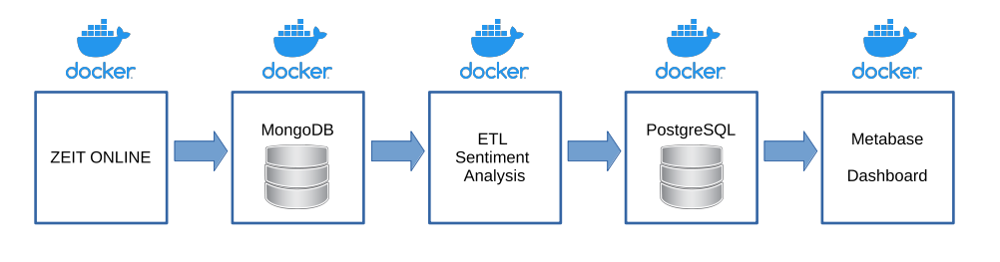

# Sentiment Analysis of Newspaper Snippets 



## Description
This **Dockerized** data pipeline extracts newspaper snippets  with the word 'Klimawandel' from ZEIT ONLINE as JSON files and stores them into a **MongoDB**. 
Then, a ETL job is performed and the transformed metadata stored in a  **PostGreSQL** database. During the ETL job the sentiment of the snippest is analyzed by comparing the words to lists with positive and negative german words. 
Finally, the data is presented on a dashboard on **metabase**.

***Notes***: this repo requires you to have your own API keys for ZEIT ONLINE. You'll also need to have docker up and running on your machine.

## Usage

1. Install Docker: https://docs.docker.com/get-docker/ (if it is not already running on your machine)
2. Clone this repo
3. Enter you API KEY in the ```config_example.py```
4. You can change the Environment Variables for the PostGreSQL
5. Inside the ```etl_job``` folder fill the files with positive and negative words. I used the lists created by Rachel Tatman from ```https://www.kaggle.com/rtatman/sentiment-lexicons-for-81-languages```
4. Go to the main folder of the project in the terminal and run docker-compose build && docker-compose up
5. In your browser open ```http://localhost:3000/``` to create a metabase

## License

MIT License


